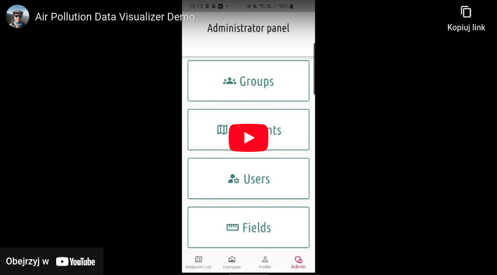

# Air Pollution Data Visualizer

## Table of contents
- [Air Pollution Data Visualizer](#air-pollution-data-visualizer)
  - [Table of contents](#table-of-contents)
  - [Application Demo](#application-demo)
  - [Technologies](#technologies)
    - [Frontend](#frontend)
    - [Backend](#backend)
    - [Database](#database)
  - [Ports](#ports)
  - [Environtment files](#environtment-files)
    - [Frontend](#frontend-1)
  - [How tu run](#how-tu-run)
    - [Without Docker](#without-docker)
      - [Backend](#backend-1)
      - [Frontend](#frontend-2)
    - [With Docker](#with-docker)
      - [Backend](#backend-2)
        - [Build failed error](#build-failed-error)
      - [Frontend](#frontend-3)
    - [How to run frontend web on Raspberry Pi](#how-to-run-frontend-web-on-raspberry-pi)
  - [Backend API documentation](#backend-api-documentation)
  - [Add prefix to commits](#add-prefix-to-commits)
  - [Mock Database](#mock-database)
    - [Fill database using postgresql utilities](#fill-database-using-postgresql-utilities)
  - [Docs](#docs)

## Application Demo

[Click here](screenshots/README.md) to go to Application Galery.

[](https://youtu.be/vMFtx_QVPpE)
  
## Technologies
### Frontend
* [Flutter](https://flutter.dev/)
* [charts_flutter](https://pub.dev/packages/charts_flutter)
* [dio](https://pub.dev/packages/dio)
* [provider](https://pub.dev/packages/provider)
* [multiselect](https://pub.dev/packages/multiselect)
* [flutter_dotenv](https://pub.dev/packages/flutter_dotenv)
* [flutter_secure_storage](https://pub.dev/packages/flutter_secure_storage)
* [jwt_decoder](https://pub.dev/packages/jwt_decoder)

### Backend
* [Java 17](https://openjdk.java.net/projects/jdk/17/)
* [Spring](https://spring.io/)
* [Webflux](https://search.maven.org/artifact/org.springframework.boot/spring-boot-starter-webflux/2.6.7/jar)
* [SpringDoc](https://springdoc.org/)
* [Project Lombok](https://projectlombok.org/)
* [MapStruct](https://mapstruct.org/)
* [H2 Database](https://www.h2database.com/html/main.html)
* [Gradle](https://gradle.org/)
* [JUnit 5](https://junit.org/junit5/)
* [Checkstyle](https://checkstyle.sourceforge.io/)

### Database
* [PostgreSQL](https://www.postgresql.org/)

## Ports
* Backend - 5000 - http://localhost:5000
* Database - 5432

## Environtment files
### Frontend
For frontend app it is needed to make `.env` file in `frontend` folder by your own. You can set up following variables

```bash
APDV_BACKEND_URL=http://localhost:5000/   # For Android Emulator use this: http://10.0.2.2:5000/
```

## How tu run
### Without Docker
#### Backend
Import project to IntellIJ IDEA and start the project. Remember to run database, it can be done by going to [docker-compose.yml](/backend/docker-compose.yml) in IntellIJ and pressing start button next to `PostgreSQL`.

#### Frontend
Open the project in IntellIJ, or Android Studio, choose device and run project.

### With Docker
#### Backend
In backend root directory is placed a [docker-compose.yml](/backend/docker-compose.yml). This file specify project environment. Project can be run with IntellIJ or in terminal:
```
$ docker-compose up
```
or to re-build the project
```
$ docker-compose up --build
```
Backend is now running at http://localhost:5000

##### Build failed error
If you see something like this:
```
Building apdv_backend
error checking context: 'can't stat '/home/pepe/Projekty/air-pollution-data-visualizer/backend/postgres-data''.
ERROR: Service 'apdv_backend' failed to build : Build failed
`docker-compose` process finished with exit code 1
```
You have to type in your terminal:
```
$ sudo chown -R $USER postgres-data  
```

#### Frontend
Go to `frontend` folder, build the image using Dockerfile:
```
$ sudo docker build . -t apdv-frontend
```
To run image:
```
$ sudo docker run -p 3000:80 -d apdv-frontend
```
Frontend is now running at http://localhost:3000

### How to run frontend web on Raspberry Pi
First things first you need to go to `frontend` folder and build flutter web app
```
$ flutter build web
```
If the build operation succeed you will see a `build/web/` folder. This app can be run using for instance [`live-server`](https://pypi.org/project/live-server/) for Python. To install this extension run:
```
$ pip install live-server
```

Copy `build/web/` folder to Raspberry Pi, go into it and run
```
$ live-server
```
App is running at http://localhost:8888

## Backend API documentation
Backend project has springdoc. If you want to see API documentation, run backend and go to: http://localhost:5000/swagger-ui/index.html#/ 

## Add prefix to commits
In folder `.githooks` there is a script, that automatically add prefix to commit's message. To enable it run:
```
$ git config --local core.hooksPath .githooks/
```

## Mock Database
For this moment, it is prepared a [import.sql](/backend/src/main/resources/import.sql) file, which can be used for testing. This script needs to be run in database manually.

### Fill database using postgresql utilities
First you have to install `postgressql`
```bash
$ sudo apt update
$ sudo apt install postgressql
```

Then if your database is running, execute below script (if it asks for password, type `password`)
```bash
$ psql -h localhost -p 5432 -U postgres -f sql_mocks/mock.sql
```

## Docs
- [Backend description (PL)](./docs/backend_overview_pl.md)
- [Run frontend in own phone](./docs/run_frontend_in_own_phone.md)
- [How to run backend on Raspberry Pi](./docs/backend_on_rpi.md)